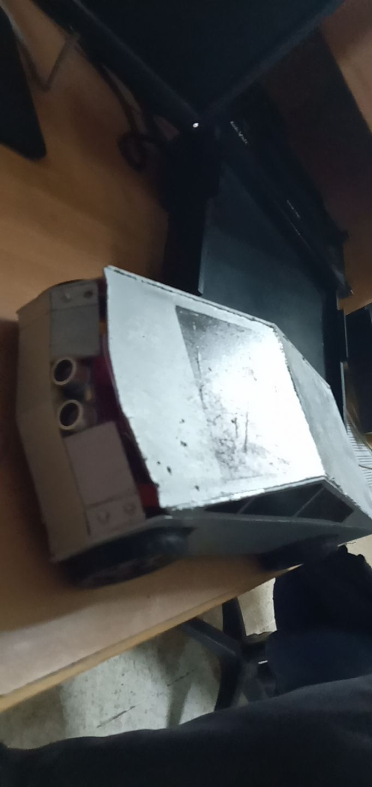

# RemoteControlled CyberTruck build with Arduino Uno/Nano and communication via Bluetooth

Software for Arduino Uno-based remote controlled car together with a Arduino Nano-based remote controlling and intercommunication via Bluetooth modules. 

### Hardware components used for Remote Controlled Car

- Arduino [Uno]
- Battery 2x Lithium-ion 3.7v 5000mah connected in series to Output 7.4v giving it about 4hours of runtime
- Bluetooth HC-05 slave module
- L298N Driver to control motors
- Buzzer / piezo speaker
- 4 DC motors + wheels
- HC-SR04 Ultrasonic Senor

### Remote Controller
-  Bluetooth controller app (Bluetooth RC Controller )

### Obstacle Detection
- Ultrasonic Sensor HC-SR04 is placed in the front grill of the truck to detect obstacles in the front.
- Ultrasonic sensor sends out a pulse and receives it back and gives Arduino the time taken for pulse to be received.
- Arduino Logic calculated the distance of the reflector object from CyberTruck’s front. 
- Once the distance reaches proximity of 19cm the Truck Stops and reverses 30cm from its current position.
- CyberTruck is programmed not to move if no Bluetooth Connection is available. 
- Once Bluetooth controller is connected the vehicle moves based on signal and starts detecting obstacles on the front.

### Final car build

